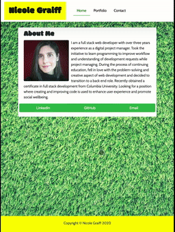
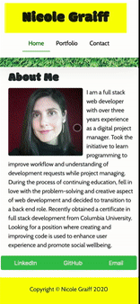

# Responsive Bio Page

Link to published page: https://keycole.github.io/responsive-portfolio/

## Purpose
Responsive portfolio page to showcase experience and past work.


Pages:
* Bio Page
* Portfolio Page
* Contact Page

## Built with: 
1. Bootstrap https://getbootstrap.com/
   
   **CSS files:** 
   ```
   <link rel="stylesheet" href="https://stackpath.bootstrapcdn.com/bootstrap/4.5.0/css/bootstrap.min.css" integrity="sha384-9aIt2nRpC12Uk9gS9baDl411NQApFmC26EwAOH8WgZl5MYYxFfc+NcPb1dKGj7Sk" crossorigin="anonymous">
   ```
   
   **JS files:** 
   ```
   * <script src="https://code.jquery.com/jquery-3.5.1.slim.min.js" integrity="sha384-DfXdz2htPH0lsSSs5nCTpuj/zy4C+OGpamoFVy38MVBnE+IbbVYUew+OrCXaRkfj" crossorigin="anonymous"></script>
   * <script src="https://cdn.jsdelivr.net/npm/popper.js@1.16.0/dist/umd/popper.min.js" integrity="sha384-Q6E9RHvbIyZFJoft+2mJbHaEWldlvI9IOYy5n3zV9zzTtmI3UksdQRVvoxMfooAo" crossorigin="anonymous"></script>
   * <script src="https://stackpath.bootstrapcdn.com/bootstrap/4.5.0/js/bootstrap.min.js" integrity="sha384-OgVRvuATP1z7JjHLkuOU7Xw704+h835Lr+6QL9UvYjZE3Ipu6Tp75j7Bh/kR0JKI" crossorigin="anonymous"></script>
   ```

1.  Assets:
   * Favicon from Favicon.io: https://favicon.io/emoji-favicons/four-leaf-clover/ 
   * Placeholder portfolio images from https://unsplash.com/


## Site Demo:


**Desktop**


**Tablet**




**Mobile**



- - -

© 2020 Nicole Graiff. All Rights Reserved.
